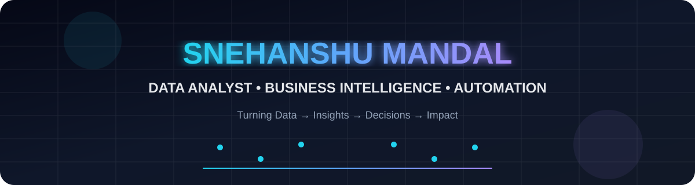
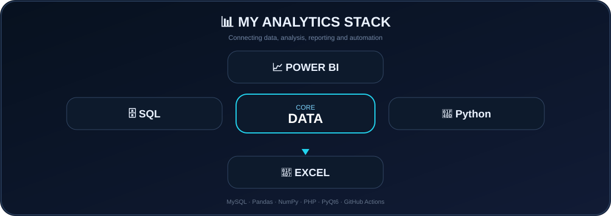
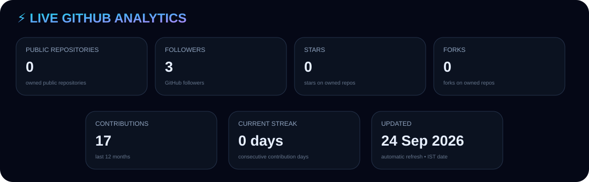
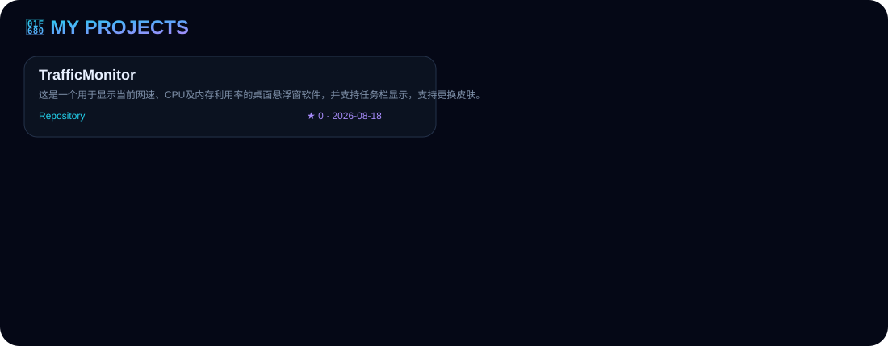

# 👋 Hi, I'm Snehanshu Mandal

### 📊 Data Analyst · Business Intelligence · Python · SQL · Automation

**Turning data into insights, and repetitive work into automation.**

  

---

## 👨‍💻 About Me

I work across **data analysis, business intelligence, software development and automation**, with a focus on building useful systems around real-world data and business processes.

- 📊 Data analysis, dashboards and MIS reporting
- 🐍 Python automation and application development
- 🗄️ SQL, MySQL, MariaDB and database systems
- 📈 Business intelligence and reporting workflows
- 📑 Excel, CSV and PDF data processing
- 🖥️ PyQt6 desktop applications
- 🌐 PHP web applications
- ⚙️ GitHub Actions and automated workflows

---

## 📊 MY ANALYTICS STACK

---

## ⚡ LIVE GITHUB COMMAND CENTER

---

## 🚀 MY PROJECTS

---

## 🛰️ RECENT ACTIVITY

---

## 🛠️ TECHNOLOGY & LANGUAGE MIX

---

## 💡 WHAT I BUILD

| Area | Focus |
|---|---|
| 📊 Analytics | Data analysis, dashboards, MIS and reporting |
| 🐍 Python | Automation, data processing and applications |
| 🗄️ SQL | Queries, database design and business data |
| 📈 BI | Power BI, Excel and insight-driven reporting |
| 🖥️ Applications | PyQt6 desktop and PHP web applications |
| 📑 Documents | Excel, CSV and PDF workflows |
| ⚙️ Automation | GitHub Actions and repeatable workflows |

---

## 📊 CONTRIBUTION ACTIVITY

---

## 🐍 CONTRIBUTION SNAKE

---

## 📈 DEVELOPMENT PHILOSOPHY

> **Build useful things. Automate repetitive work. Turn data into decisions. Keep systems maintainable.**

I enjoy taking an idea from **requirement → data → analysis → implementation → automation**.

---

## 🤖 HOW THIS PROFILE STAYS LIVE

<table>
<tr>
<td align="center" width="190"><strong>🔌 GitHub API</strong> Live profile & repository data</td>
<td align="center" width="55">→</td>
<td align="center" width="190"><strong>⚙️ GitHub Actions</strong> Scheduled automation</td>
<td align="center" width="55">→</td>
<td align="center" width="190"><strong>📊 Data Processing</strong> Metrics & analytics</td>
<td align="center" width="55">→</td>
<td align="center" width="190"><strong>🎨 SVG / JSON</strong> Generated profile assets</td>
<td align="center" width="55">→</td>
<td align="center" width="190"><strong>🌐 README</strong> Updated profile</td>
</tr>
</table>

> **Automatic:** repository metrics, contribution data, project information, language statistics and profile status are generated by the profile workflow.

---

## 🎯 CURRENTLY EXPLORING

<table>
<tr>
<td align="center" width="230"> 📊 <strong>Advanced Power BI</strong> Interactive dashboards & storytelling  </td>
<td align="center" width="230"> 🐍 <strong>Python Data Engineering</strong> Pipelines, processing & automation  </td>
</tr>
<tr>
<td align="center" width="230"> 🤖 <strong>AI-assisted Analytics</strong> Smarter analysis & productivity  </td>
<td align="center" width="230"> 🏗️ <strong>Modern BI Architecture</strong> Scalable data & reporting systems  </td>
</tr>
</table>

---

## 🤝 LET'S CONNECT

  

**BUILD · ANALYZE · AUTOMATE · IMPROVE**

